# Домашнее задание к занятию «Prometheus. Часть 2» Шелухин Юрий  

### Задание 1
Создайте файл с правилом оповещения, как в лекции, и добавьте его в конфиг Prometheus.

### Требования к результату
- [ ] Погасите node exporter, стоящий на мониторинге, и прикрепите скриншот раздела оповещений Prometheus, где оповещение будет в статусе Pending

---

## Решение 1

1.  Скачаем ПО с github
wget https://github.com/prometheus/alertmanager/releases/download/v0.28.1/alertmanager-0.28.1.linux-386.tar.gz
2.  Извлекем архив  
tar vxf alertmanager-0.28.1.linux-386.tar.gz  
3.  Скопируем утилиты  
sudo cp ./alertmanager /usr/local/bin  
sudo cp ./amtool /usr/local/bin  
sudo cp ./alertmanager.yml /etc/prometheus  
4.  Передадим права на эти файлы пользователю prometheus  
sudo chown -R prometheus:prometheus /etc/prometheus/alertmanager.yml  
5. Создадим сервис  
sudo vim /etc/systemd/system/prometheus-alertmanager.service
6. Запустим сервис  
sudo systemctl enable prometheus-alertmanager.service  
sudo systemctl start prometheus-alertmanager.service   
sudo systemctl status pprometheus-alertmanager.service     
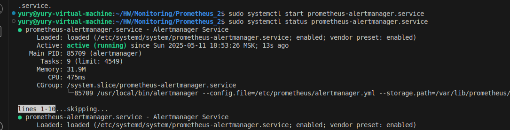  

7.  Проверим по адресу: http://192.168.65.135:9093/#/alerts
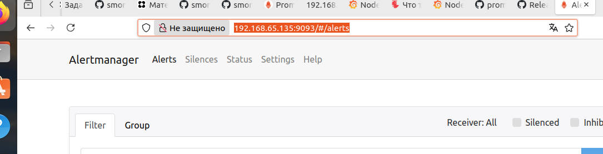  

8. Настроим prometheus для работы с alertmanager  
sudo vim /etc/prometheus/prometheus.yml  
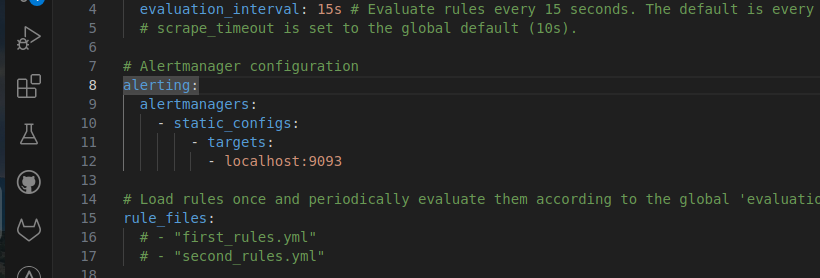      

9. Перезапустим prometheus  
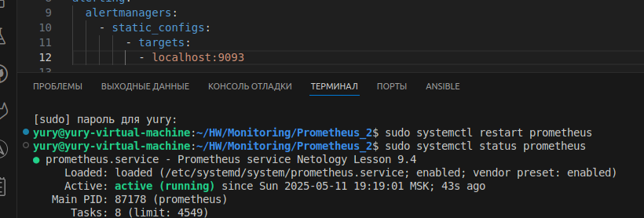  

10. Создадим правило оповещения. Создадим файл.  
sudo vim /etc/prometheus/netology-test.yml

11. Подключим правило в prometheus, перезапустим.
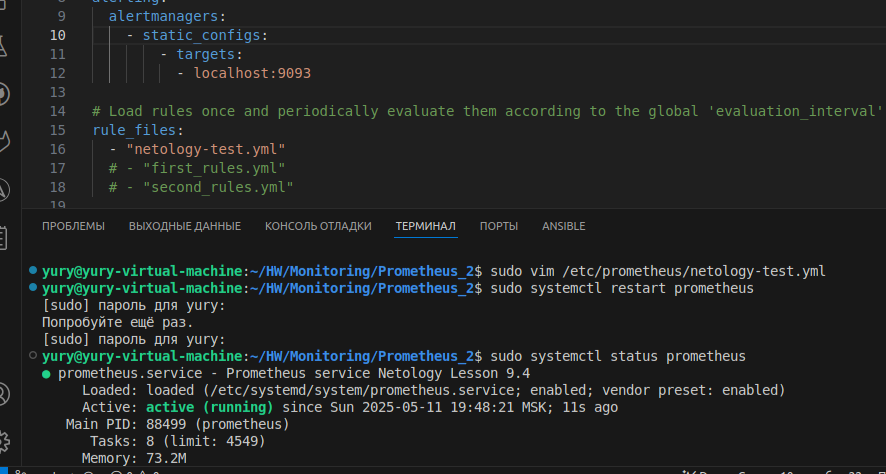   

12. Отредактируем сonfig-файл Alertmanager.Перезапустим.  
sudo nvim /etc/prometheus/alertmanager.yml
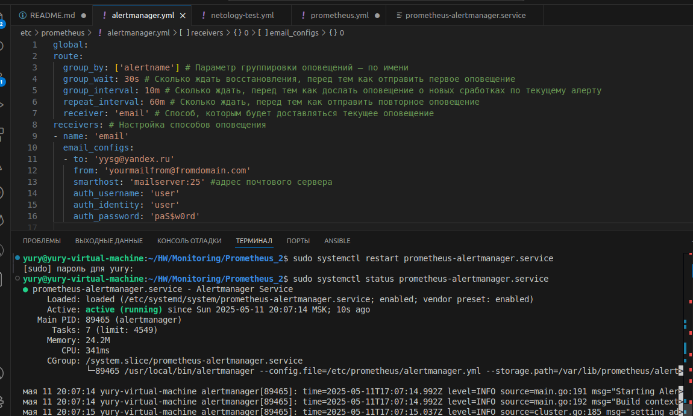  

13. Проверим интерфейс alertmanager и prometheus
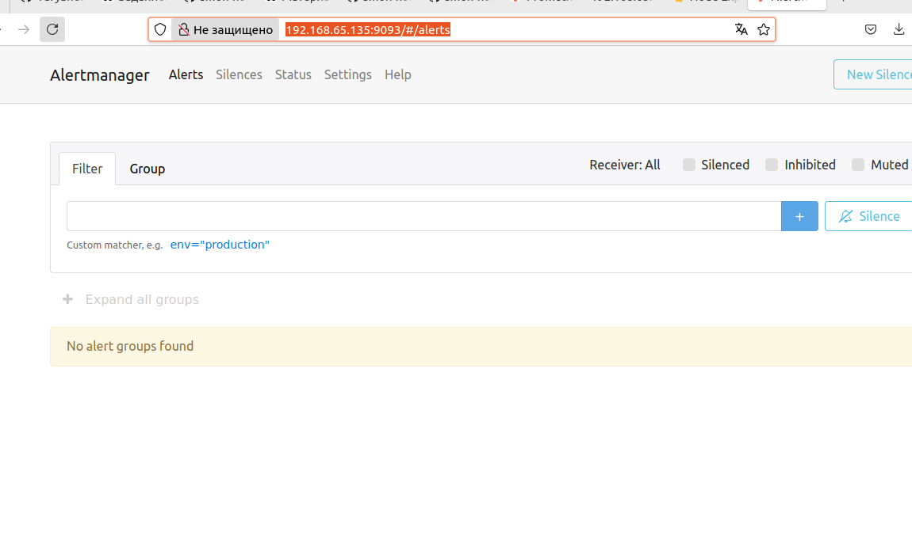   
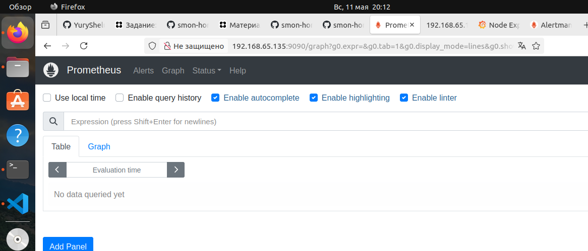  
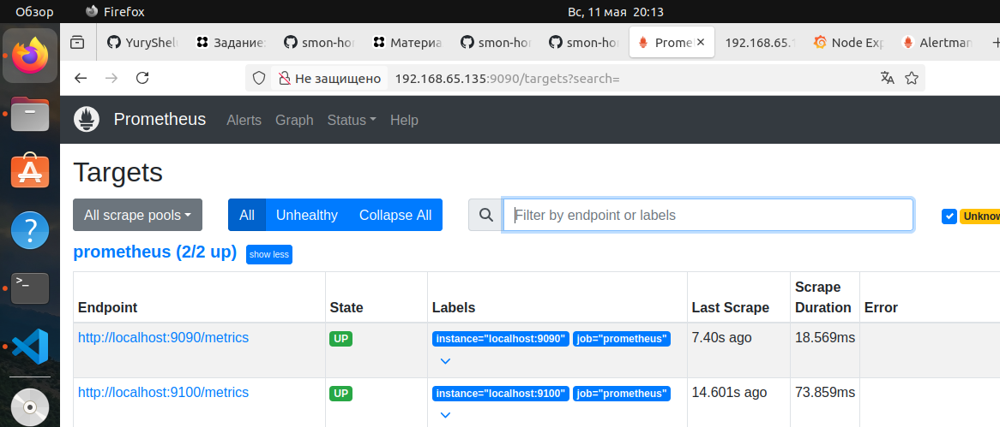  

14. Остановим node_exporter (9100)  
sudo systemctl stop node-exporter
systemctl status node-exporter
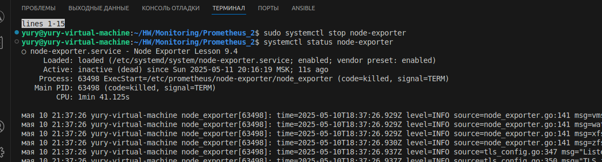  
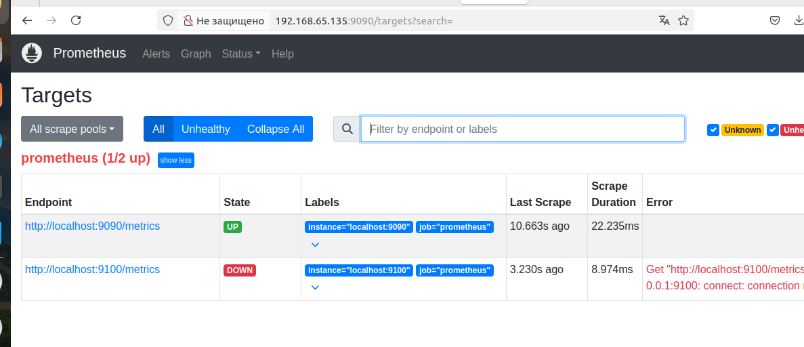  
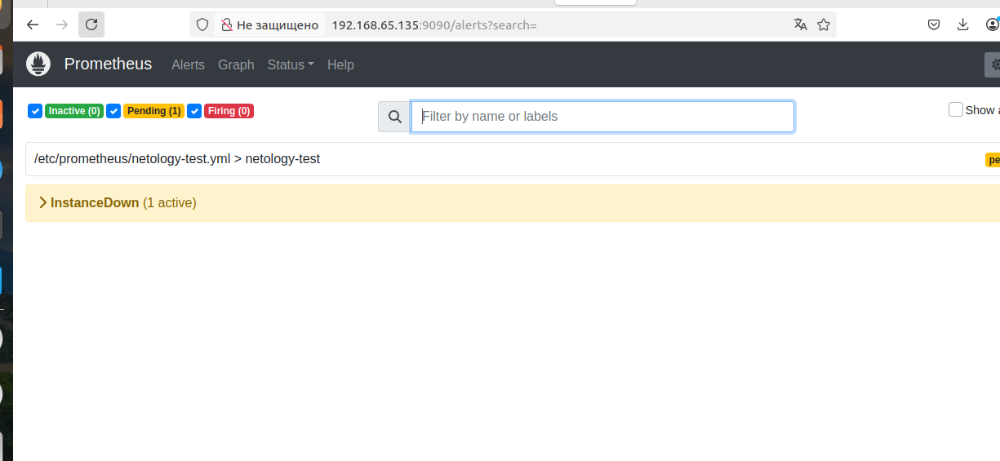  

---

### Задание 2
Установите Alertmanager и интегрируйте его с Prometheus.

### Требования к результату
- [ ] Прикрепите скриншот Alerts из Prometheus, где правило оповещения будет в статусе Fireing, и скриншот из Alertmanager, где будет видно действующее правило оповещения

---

### Задание 3

Активируйте экспортёр метрик в Docker и подключите его к Prometheus.

### Требования к результату
- [ ] приложите скриншот браузера с открытым эндпоинтом, а также скриншот списка таргетов из интерфейса Prometheus.*

---

### Задание 4* (со звездочкой)

Создайте свой дашборд Grafana с различными метриками Docker и сервера, на котором он стоит.

---

